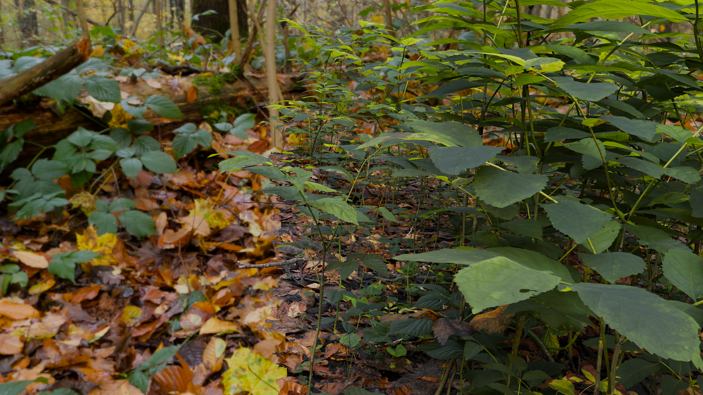

# AIAA

AI Antialiasing is a techinique that uses a neural network to simulate the high-quality antialiasing of SSAA4x as a fast post process.

The model is currently trained on a set of 512 renders of ```demo_scene``` at both (1920x1080) and (3840x2160) downscaled for antialiasing.

Currently, the model runs at approximately 270-350ms, or a possible framerate of 2.8-3.5 fps.

Limited training data also confines this model's accuracy to ```demo_scene```.

Future updates will include substantial performance improvements and applicability to imagery beyond the demo.

# How to Run

There is no official implementation yet. For now, clone the repository and open ```demo_scene.blend``` in Blender. Run ```render_test.py``` in the scripting tab to render at a random camera position (or tweak to your liking).

Then run ```main.py``` to antialias the image, stored in ```output/```.

Run ```check_version.py``` to see if you can run on a CUDA GPU.

# Results

Below is a comparison of a frame aliased, at SSAA4x, and AIAA (Click to view images in full resolution).


*Alias*



*SSAA4x*


*AIAA*

# Dependencies

- Pillow
- Torch with Cuda 12.6
- Torchvision
- TQDM
