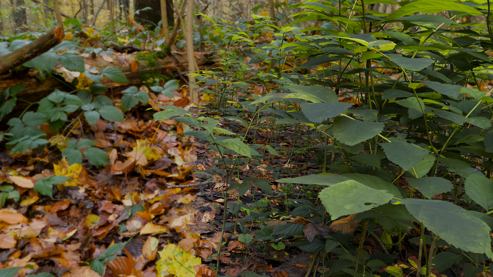

# AI Antialiasing

AIAA is a techinique that uses a neural network to simulate the high-quality antialiasing of SSAA4x as a fast post process.

The model is currently trained on a set of renders of ```demo_scene``` at both stadard and supersampled resolutions downscaled for antialiasing.

On a 2080ti the model averages a maximum possible framerate of approximately 400 fps (at 1080p and 4x supersampling) and 1400 fps (at 540p and 16x supersampling).

Limited training data also confines this model's accuracy to ```demo_scene```.

# How to Run

There is no official implementation yet. For now, clone the repository and open ```demo_scene.blend``` in Blender. Run ```render_test.py``` in the scripting tab to render at a random camera position (or tweak to your liking).

Then run ```main.py``` to antialias the image, stored in ```output/```.

Run ```check_version.py``` to check Cuda Compatability.

# Results

Below is a comparison of a frame aliased, supersampled, and AIAA at 1080p (Click to view images in full resolution).


*Alias*



*SSAA4x*


*AIAA*

# Requirements
- Cuda-capable GPU with compute > 7.0 (RTX 20-Series or Newer)
- Python 3.9 - 3.12

# Dependencies

- Pillow
- Torch 2.8.0 with Cuda 12.6
- Torchvision 0.23.0
- TQDM
- Triton-Windows 3.4.0.post20

# Changelog
- Trained on 540p image data
